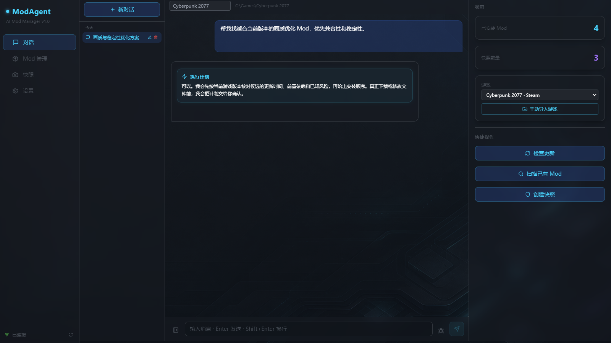
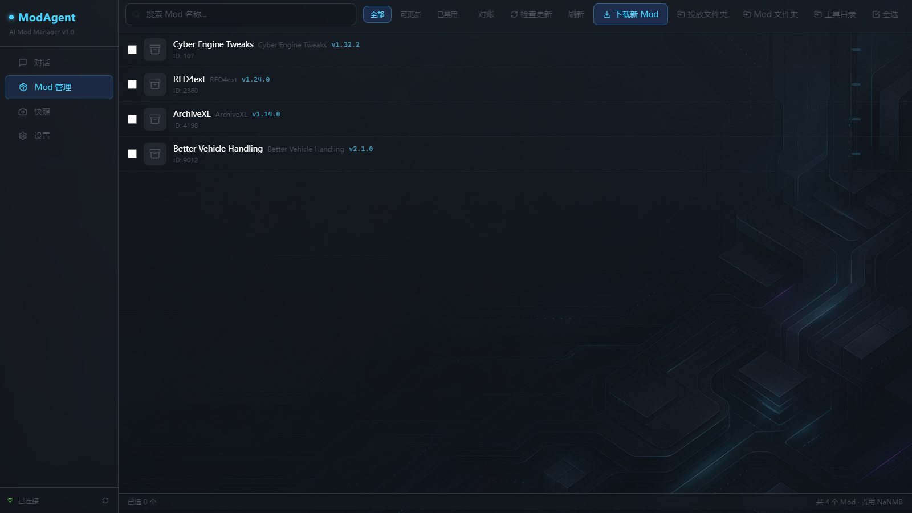
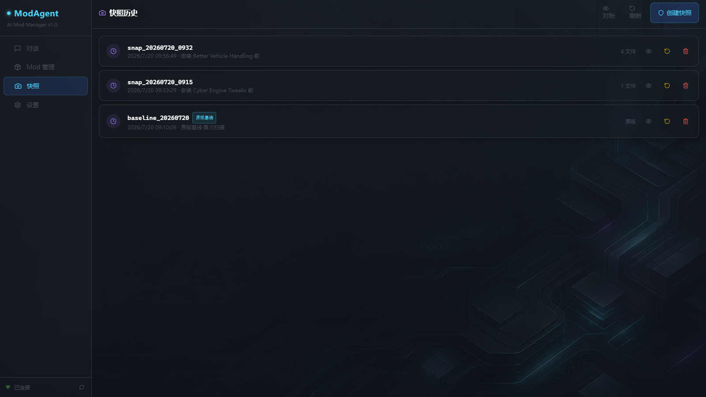
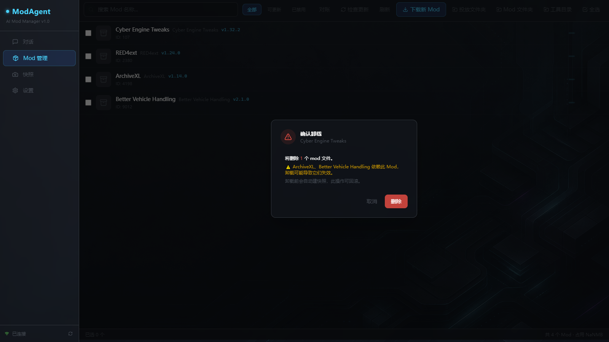

# ModAgent

面向 Windows 的本地 AI Mod 管理器：对话搜索、方案分析、安装确认、Mod 管理与快照回滚。

当前版本：**v1.3.0 稳定版候选**。

[下载普通版](https://github.com/millips/ModAgent/releases) · [提交问题](https://github.com/millips/ModAgent/issues) · [隐私说明](PRIVACY.md)



## 它解决什么问题

找 Mod、看说明、确认版本和依赖、下载压缩包、安装到游戏目录、出问题后恢复——这些步骤通常分散在网页和文件夹里。

ModAgent 把核心流程整理进一个桌面界面：

- 用自然语言描述想找的 Mod
- 汇总候选并分析功能、更新时间、依赖和风险
- 真正修改本地文件前由用户确认
- 集中查看、启用、禁用和卸载已安装 Mod
- 用快照记录关键状态，并在回滚前预览影响

## 实机界面

| Mod 管理 | 快照历史 |
|---|---|
|  |  |



## 下载与安装

前往 [GitHub Releases](https://github.com/millips/ModAgent/releases)：

- 大多数用户下载 `ModAgent-Setup-<版本>.exe`
- 免安装使用下载 `ModAgent-Portable-<版本>.zip`
- 使用同一 Release 中的 `SHA256SUMS.txt` 校验文件完整性

当前发布目标为 Windows x64。

## 首次使用

1. 启动 ModAgent。
2. 按界面提示配置一个大模型 API Key；Nexus Mods 和 Tavily 均可跳过，之后再补。
3. 选择自动识别到的游戏，或手动导入游戏目录。
4. 先创建原版基线快照。
5. 在对话页描述需求，核对分析和操作计划后再执行。

## 重要限制

- ModAgent 不绕过 Nexus Mods 的登录、人机验证或下载限制。
- 遇到验证页面或 “Slow download” 时，需要用户完成平台要求的操作。
- 未特化适配的游戏会使用通用规则，安装位置与文件清单必须由用户核对。
- 快照不能替代存档和重要个人文件的独立备份。
- Mod 内容、版权、兼容性和可用性由相应作者及第三方平台负责。

## 普通版与 ModAgent P

普通版和 P 共用完整的 Agent 推荐、核验、计划、安装与回滚闭环；P 只增加主题、音效、视觉动效/反馈核心和专属身份。

| 功能 | 普通版 | P |
|---|:---:|:---:|
| AI 对话、需求分析与文本推荐 | ✓ | ✓ |
| 游戏自动识别、手动导入和多安装实例 | ✓ | ✓ |
| Nexus、Steam Workshop、Thunderstore、GitHub、GameBanana 等多源搜索 | ✓ | ✓ |
| 候选详情、版本、依赖和更新活跃度核验 | ✓ | ✓ |
| 本地 Mod 扫描、导入、启用、禁用和卸载 | ✓ | ✓ |
| 下载、安装确认、安装规则和失败回滚 | ✓ | ✓ |
| 快照、影响预览和恢复 | ✓ | ✓ |
| 稳定来源绑定、更新检查和歧义阻断 | ✓ | ✓ |
| 朴素 / 设计双布局 | ✓ | ✓ |
| 结构化推荐决策表、智能预选和最终勾选联动 | ✓ | ✓ |
| 前置依赖置顶、必要依赖标记和安装顺序约束 | ✓ | ✓ |
| 暂不可安装候选的保留、核验、来源页和手动导入路径 | ✓ | ✓ |
| 推荐选择状态跨会话恢复、候选数量调节 | ✓ | ✓ |
| JSON、INI、CFG、TXT、XML 配置智能补丁 | ✓ | ✓ |
| P 专属主题与氛围打光 | — | ✓ |
| P 专属音效 | — | ✓ |
| P 视觉动效与反馈核心 | — | ✓ |
| P 专属图标和身份标识 | — | ✓ |

两版目前都需要用户配置自己的大模型 API Key；Nexus 和 Tavily 为可选增强。ModAgent P 首发提供 3 天试用，爱发电兑换码离线验证后开放 60 天。到期只关闭四类 P 表现层权益，不影响核心功能和用户数据。

完整边界和不承诺事项见 [普通版与 P 功能矩阵](docs/EDITION-COMPARISON.md)。GitHub 普通版不包含 P 专有资源和许可证公钥。

## 从源码运行

环境要求：

- Python 3.10+
- Node.js
- Windows

后端：

```powershell
python -m pip install -r requirements.txt
python -m modagent.api
```

前端：

```powershell
cd electron
npm install
$env:MODAGENT_EDITION='free'
npm run dev
```

构建普通版候选发布目录：

```powershell
cd electron
npm run release:github-free
```

输出位于 `electron/release/github-free/v<版本>-candidate/`。工作树未提交时，清单会明确标记为候选测试包，不允许伪装成正式可追溯 Release。

## 反馈

提交 Issue 时请提供：

- ModAgent 版本
- 游戏名称
- 可复现的操作步骤
- 期望结果与实际结果
- 已脱敏的日志或截图

请勿提交 API Key、Cookie、账号信息或包含私人目录信息的完整日志。

## 许可

普通版源代码按 [GNU GPL v3](LICENSE-GPL-3.0.txt) 发布。第三方组件、第三方 Mod 与订阅资源的许可边界见：

- [项目许可说明](LICENSE.md)
- [第三方声明](THIRD_PARTY_NOTICES.md)
- [第三方 Mod 免责声明](THIRD-PARTY-MODS-DISCLAIMER.md)
